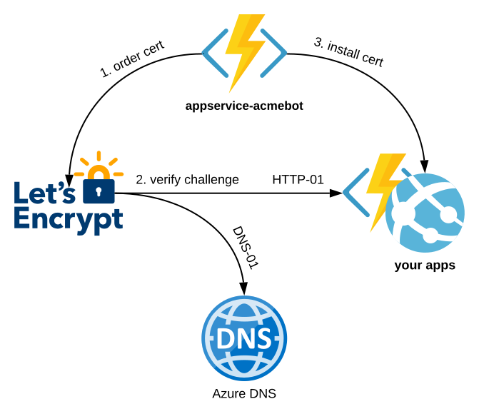

# App Service Acmebot


[](https://github.com/shibayan/appservice-acmebot/releases/latest)
[](https://github.com/shibayan/appservice-acmebot/blob/master/LICENSE)
[](https://registry.terraform.io/modules/shibayan/appservice-acmebot/azurerm/latest)

This is an application that automates the issuance and renewal of ACME SSL/TLS certificates for Azure App Services.

- Support for multiple App Services
- Easy to deploy and configure
- Highly reliable implementation
- Ease of Monitoring (Application Insights, Webhook)

You can add multiple certificates to a single App Service.

## Announcements

### Integration with Key Vault

If you need to use the certificate for a variety of services, consider using the Key Vault version of Acmebot v3.

https://github.com/shibayan/keyvault-acmebot

The Key Vault version can be used with services that support Key Vault certificates, such as App Service / Application Gateway / CDN / Front Door.

## Table Of Contents

- [Feature Support](#feature-support)
- [Requirements](#requirements)
- [Getting Started](#getting-started)
- [Usage](#usage)
- [Troubleshooting](#troubleshooting)
- [Thanks](#thanks)
- [License](#license)

## Feature Support

- Azure Web Apps and Azure Functions (Windows)
- Azure Web Apps (Linux) / Web App for Containers (Windows and Linux, requires Azure DNS)
- Azure App Service Environment (Windows and Linux)
- Issuing a certificate to the Deployment Slot
- Issuing certificates for Zone Apex Domains
- Issuing certificates with SANs (subject alternative names) (one certificate for multiple domains)
- Wildcard certificate (requires Azure DNS)
- Support for multiple App Services in a single application
- ACME-compliant Certification Authorities
  - [Let's Encrypt](https://letsencrypt.org/)
  - [Buypass Go SSL](https://www.buypass.com/ssl/resources/acme-free-ssl)
  - [ZeroSSL](https://zerossl.com/features/acme/) (Requires EAB Credentials)

[](https://www.lucidchart.eu/documents/view/77879337-7889-41d9-bd2d-c3a184f9587b)

## Requirements

- Azure Subscription
- App Service with a registered custom domain
- Email address (required to register with Let's Encrypt)

## Getting Started

### 1. Deploy Acmebot

| Azure (Public) | Azure China | Azure Government |
| :---: | :---: | :---: |
| <a href="https://portal.azure.com/#create/Microsoft.Template/uri/https%3A%2F%2Fraw.githubusercontent.com%2Fshibayan%2Fappservice-acmebot%2Fmaster%2Fazuredeploy.json" target="_blank"></a> | <a href="https://portal.azure.cn/#create/Microsoft.Template/uri/https%3A%2F%2Fraw.githubusercontent.com%2Fshibayan%2Fappservice-acmebot%2Fmaster%2Fazuredeploy.json" target="_blank"></a> | <a href="https://portal.azure.us/#create/Microsoft.Template/uri/https%3A%2F%2Fraw.githubusercontent.com%2Fshibayan%2Fappservice-acmebot%2Fmaster%2Fazuredeploy.json" target="_blank"></a> |

### 2. Add application settings

Update the following configuration settings of the Function App:

- `Acmebot:Webhook`
  - Webhook destination URL (optional, Slack and Microsoft Teams are recommended)

There are also additional settings that will be automatically created by App Service Acmebot:

- `Acmebot:Endpoint`
  - The ACME endpoint used to issue certificates
- `Acmebot:Contacts`
  - The email address (required) used in ACME account registration

### 3. Enable App Service Authentication

You must enable Authentication on the Function App that is deployed as part of this application.

In the Azure Portal, open the Function blade then select the `Authentication` menu and enable App Service authentication. Click on the `Add identity provider` button to display the screen for adding a new identity provider. If you select `Microsoft` as your Identity provider, the required settings will be automatically filled in for you. The default settings are fine.


Make sure that the App Service Authentication setting is set to `Require authentication`. The permissions can basically be left at the default settings.


If you are using Sovereign Cloud, you may not be able to select Express. Enable authentication from the advanced settings with reference to the following document.

https://docs.microsoft.com/en-us/azure/app-service/configure-authentication-provider-aad#-configure-with-advanced-settings

Finally, you can save your previous settings to enable App Service authentication.

### 4. Add access control (IAM) to the target resource group

Open the `Access control (IAM)` of the target resource group and assign the roles `Website Contributor` and `Web Plan Contributor` to the deployed application.


**Remarks**

If the App Service Plan associated with the App Service exists in a separate resource group, you should assign a `Website Contributor` to the resource group where the App Service exists, and a `Web Plan Contributor` to the resource group where the App Service Plan exists.

## Usage

### Issuing a new certificate

Access `https://YOUR-FUNCTIONS.azurewebsites.net/add-certificate` with a browser and authenticate with Azure Active Directory and the Web UI will be displayed. Select the target App Service and domain from that screen and run it, and after a few tens of seconds, the certificate will be issued.


If the `Access control (IAM)` setting is not correct, nothing will be shown in the drop-down list.

### Issuing a new certificate (REST API)

To automate the adding of certicates, you can use Acmebot's REST API.

```
POST /api/certificate

Content-Type: application/json
x-functions-key: asd+YourFunctionKeyHere+fgh==

{
  "ResourceGroupName": "your-webapp-rg",
  "AppName": "your-webapp",
  "SlotName": "production",
  "DnsNames": [
    "example.com",
    "www.example.com"
  ]
}
```
See also https://github.com/shibayan/keyvault-acmebot/wiki/REST-API

### Issuing a wildcard certificate or a certificate for Linux

Because Azure DNS is required to issue wildcard certificates or certificates for Linux, assign the role of `DNS Zone Contributor` in the resource group containing the target DNS zone.


To issue certificates for "App Service on Linux" and "Web App for Container", Azure DNS is always required.

### Renewing certificates

All existing ACME certificates are automatically renewed 30 days before their expiration.

The default check timing is 00:00 UTC. If you need to change the time zone, use `WEBSITE_TIME_ZONE` to set the time zone.

### Deploying a new version

The application is automatically updated so that you are always up to date with the latest version. If you explicitly need to deploy the latest version, restart the Azure Function.

### In case you want to use your own web.config

You can prevent Acmebot from creating a `web.config` by creating your own `web.config` and `configured` files in the `site/.well-known` directory.

## Troubleshooting

### Azure REST API error at `GetSite` or `Dns01Precondition` error

The role assignment to the target resource group may be incorrect or not yet active. It may take up to 30 minutes for the IAM settings to take effect.

### `CheckDnsChallenge` failed: _acme-challenge.{domain}.com value is not correct

In order for the certificate to be created, the Acmebot needs to create a TXT DNS record for `_acme-challenge` in Azure DNS. This error occurs when the TXT record isn't being served. One cause of this may be that the nameservers for your domain may be pointing to the domain registrar, rather than Azure DNS. Make sure that you have properly delegated the domain to Azure DNS: [Host your domain in Azure DNS](https://docs.microsoft.com/en-us/azure/dns/dns-delegate-domain-azure-dns#delegate-the-domain)

### `CheckHttpChallenge` failed: http://{domain}/.well-known/acme-challenge/{challenge} is InternalServerError status code

This seems like an URL rewrite error. Try setting `inheritInChildApplications="false"` in the web.config under wwwroot.

https://www.hanselman.com/blog/ChangingASPNETWebconfigInheritanceWhenMixingVersionsOfChildApplications.aspx

## Thanks

- [ACMESharp Core](https://github.com/PKISharp/ACMESharpCore) by @ebekker
- [Durable Functions](https://github.com/Azure/azure-functions-durable-extension) by @cgillum and contributors
- [DnsClient.NET](https://github.com/MichaCo/DnsClient.NET) by @MichaCo

## License

This project is licensed under the [Apache License 2.0](https://github.com/shibayan/appservice-acmebot/blob/master/LICENSE)
